# Summary 
    search"stock price prediction" in paperwithcode.com
    also search "stock prediction" in paperwithcode.com to see related papers
    今天才发现可以搜索"stock return prediction",这个更好


## 此文档中所有被看好的title的汇总：

- Diffusion Variational Autoencoder for Tackling Stochasticity in Multi-Step Regression Stock Price Prediction

- Stock Broad-Index Trend Patterns Learning via Domain Knowledge Informed Generative Network

- Astock: A New Dataset and Automated Stock Trading based on Stock-specific News Analyzing Model

- A Word is Worth A Thousand Dollars: Adversarial Attack on Tweets Fools Stock Predictions
- Stock Movement Prediction Based on Bi-typed Hybrid-relational Market Knowledge Graph via Dual Attention Networks
- Long Term Stock Prediction based on Financial Statements
- Price graphs: Utilizing the structural information of financial time series for stock prediction
- Trade the Event: Corporate Events Detection for News-Based Event-Driven Trading
- Stock price prediction using Generative Adversarial Networks
- Multi-Graph Convolutional Network for Relationship-Driven Stock Movement Prediction
- Enhancing Stock Movement Prediction with Adversarial Training
- Temporal Relational Ranking for Stock Prediction
- DP-LSTM: Differential Privacy-inspired LSTM for Stock Prediction Using Financial News
- S&P 500 Stock Price Prediction Using Technical, Fundamental and Text Data
- FactorVAE: A Probabilistic Dynamic Factor Model Based on Variational Autoencoder for Predicting Cross-Sectional Stock Returns

#  下面是一些比较被看好的文章，主要说说他们的可取之处

### diffusion variational autoencoder&pytorch（还行吧，不是很了解）:

    Diffusion Variational Autoencoder for Tackling Stochasticity in Multi-Step Regression Stock Price Prediction

- **author&date:**:2023/8/18 & National University of Singapore

- **model**:diffusion variational autoencoder

- **data**:形如AAPL.csv feature:open,high,low,close,volume

- **estimation**:还行，先记录下来

- **framework**:pytorch

- **news relevant**:

- **insight**: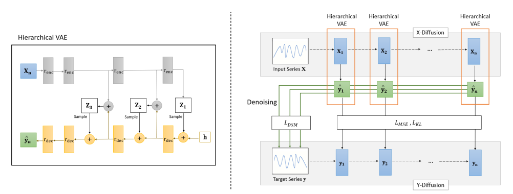

- **experiment**: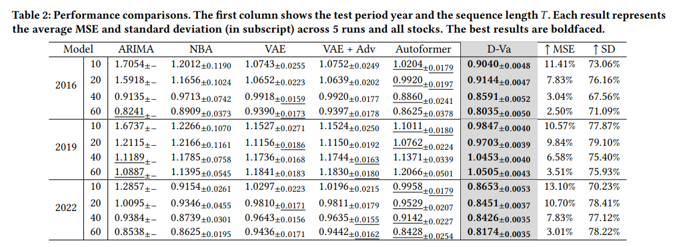

- **实际运行github代码**:

  ```
  按照github上的提示可以直接运行
  从头训练一遍2016年的所有数据并test其mse大概需要三个小时（autodl_3080）
  ```

**remark**:
    

    论文任务是预测单只股票的价格/收益率，并在后文给出投资组合
    diffusion我不太了解，但看这个是用mse作为评判指标感觉很奇怪
    不过幸好后文有对投资组合的sharp ratio
    这个论文的数据集是很常用的数据集，feature也很常用，感觉还还行，似乎还有指数增强

**ideas**:
    

    difussion model 可以考虑一下


​    
**link**:
- **GitHub code**:https://github.com/koa-fin/dva
- **Paper with Code**:https://paperswithcode.com/paper/diffusion-variational-autoencoder-for

### GAN(GRU,Attention Layer)&pytorch（看好）:

    Stock Broad-Index Trend Patterns Learning via Domain Knowledge Informed Generative Network
- **author&date:**:2023.2.27 & New Jersey Institute of Technology
- **model**:GAN(GRU,Attention Layer)
- **data**:有编码化的news_data,也有很平常的stock_data
- **estimation**:看起来逻辑清晰，思维缜密，很难得用的是acc,而且效果可以达60%,总体来看非常不错
- **framework**:pytorch
- **news relevant**:Relevant
- **insight**: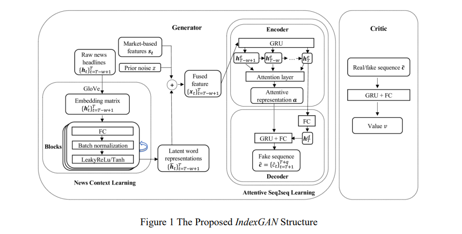
- **experiment**: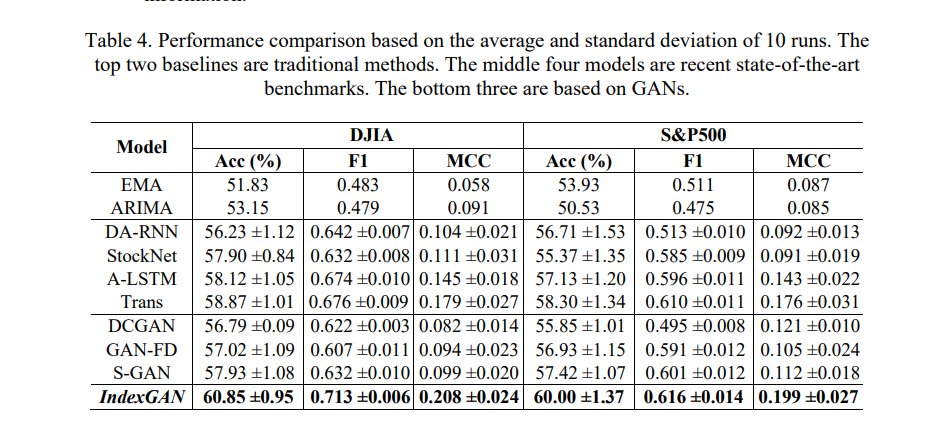

**remark**: 
    
    非常规范，还在github里放了自己最终学习的，模型的参数
    正确率一看就很真实，eg:他的对照组的真确率可以到57%（LSTM）这个数看起来就很正常
**ideas**:
    
    或许可以把他的GRU进行改进？GAN我目前不太了解，之后要去学习一下
**link**:
- **GitHub code**:https://paperswithcode.com/paper/stock-broad-index-trend-patterns-learning-via
- **Paper with Code**:https://paperswithcode.com/paper/stock-broad-index-trend-patterns-learning-via

### Transformer&pytorch（看好）:

    Astock: A New Dataset and Automated Stock Trading based on Stock-specific News Analyzing Model
- **author&date:**:2022.06.14 & (学校似乎一般而且为什么有6个共同一作？)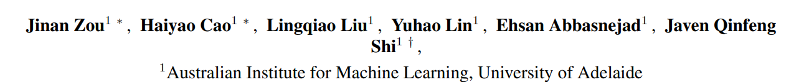
- **model**:Transformer
- **data**:github上的代码感觉他没处理好,高开低收都放一列了
- **estimation**:accuracy效果很好，很赞，又是基于transformer的，如果他数据和结果可以复现的话这个很值得考虑
- **framework**:pytorch
- **news relevant**:相关
- **insight**: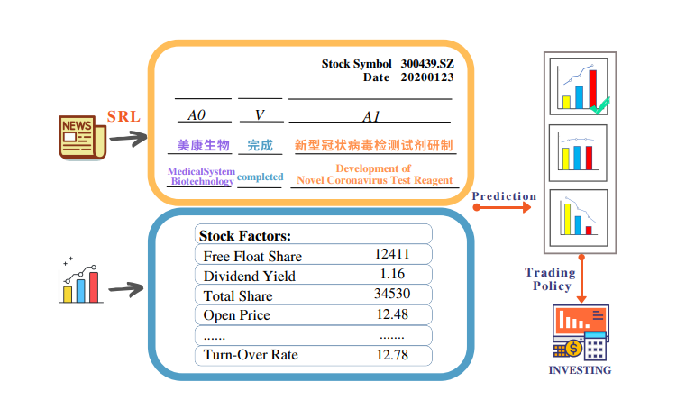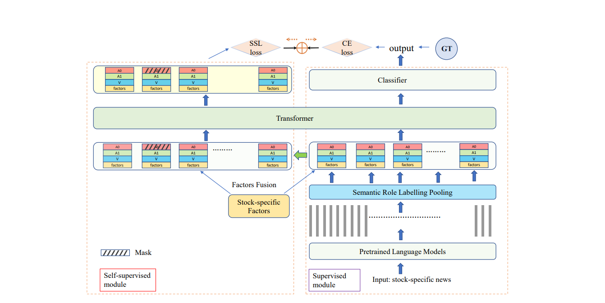
- **experiment**: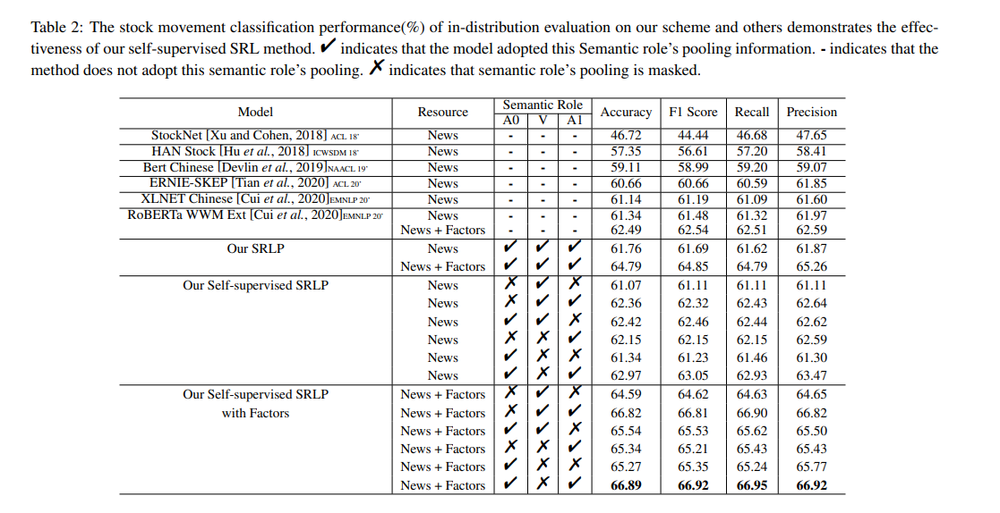

**remark**: 
    

    github上的star很多，是基于transformer很好，从论文来看效果非常好，正确率可以到66%，同时似乎加了一些新闻的信息；
    当然，他这个数据处理我不是很很懂？为啥把高开低收都放一列？（是他在读入数据的时候就是这么干的，有可能是这很可能是一个制表符分隔的 .tsv 文件（Tab-Separated Values），但有可能被保存为 .csv 扩展名）
**github代码实现**：

```
感觉很奇怪，我不太会运行，不过这个的环境可以配好
后续我会好好看看这个里面的那些.ipynb文件里写的都是些什么东西
```


**link**:

- **GitHub code**:https://paperswithcode.com/paper/astock-a-new-dataset-and-automated-stock
- **Paper with Code**:https://paperswithcode.com/paper/astock-a-new-dataset-and-automated-stock

### Title（还行）:

    A Word is Worth A Thousand Dollars: Adversarial Attack on Tweets Fools Stock Predictions
**remark**: 
    

    论文投至ACL和NAACL,但论文里研究的东西我完全看不懂（没花时间看）
    似乎是类似NLP预测网络攻击，主要是他的github上的star很少，而且他22年就发表了，好像用了一些RNN
    总体而言类似于基于twitter文本分析预测股价
**data**:有基本的股票数据，也有这样的文本数据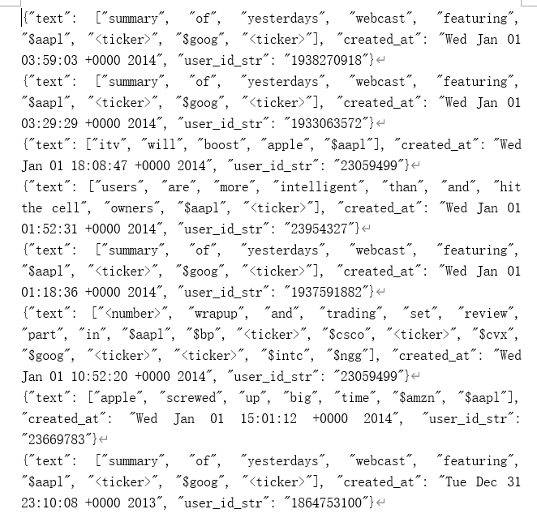
**link**:
- **GitHub code**:https://github.com/yonxie/advfintweet
- **Paper with Code**:https://paperswithcode.com/paper/a-word-is-worth-a-thousand-dollars-2

### GRU+Graph+attention&pytorch（一般吧）:

    Stock Movement Prediction Based on Bi-typed Hybrid-relational Market Knowledge Graph via Dual Attention Networks
**data**:新闻标题和股票数据
**author**: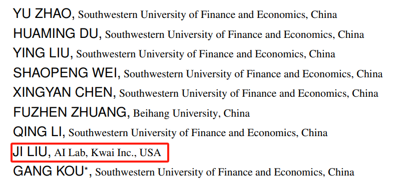
**model**:GRU+Graph+Dual Attention
**framework**:pytorch
**experiment**: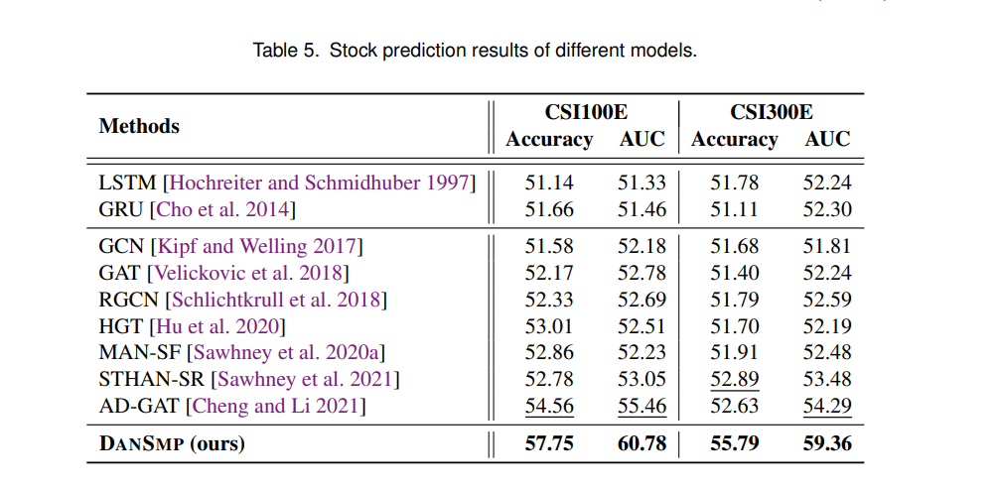
**insight**: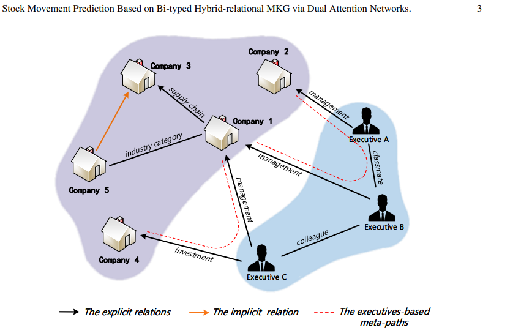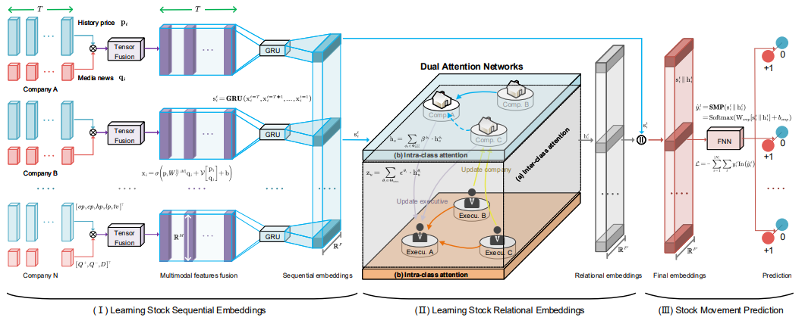!

**remark**: 
    
    文章思路很有趣，但很多地方我看不懂。github上的代码很专业，甚至有rawdata和preprocess的data和code

**link**:
- **GitHub code**:https://github.com/trytodoit227/dansmp
- **Paper with Code**:https://paperswithcode.com/paper/stock-movement-prediction-based-on-bi-typed-1

### LSTM&tf（很一般）：

    （没啥参靠价值，这人就是简单调包了，但是把任务做得投机取巧，accuracy乍一眼一看很高）
    Long Term Stock Prediction based on Financial Statements
- **author&date:**:2021 & from stanford
- **model**:LSTM
- **data**:daily_stock_data with some yearly statistics & 年度财务报表
- **estimation**:

      效果很好，就是没什么创新，单纯就是用了LSTM，我也不知道你为啥效果这么好？
      个人感觉他投机取巧了，他的任务改成了预测年化的收益率的大体分类，分了5类
      但是没有后续了，没有shrp-ratio之类的指标，对我没什么参考价值

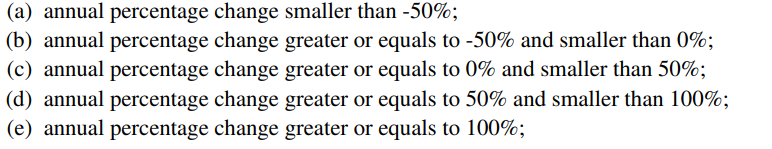

- **framework**:tensorflow
- **news relevant**:不相关
- **experiment**: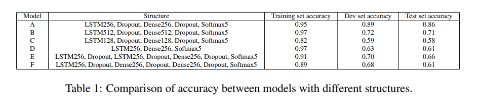

**remark**: 

    鸡肋
**link**:
- **GitHub code**:https://paperswithcode.com/paper/long-term-stock-prediction-based-on-financial
- **Paper with Code**:https://paperswithcode.com/paper/long-term-stock-prediction-based-on-financial

### Transformer&pytorch（看起来非常不错）:

    Price graphs: Utilizing the structural information of financial time series for stock prediction
- **author&date:**:2021.7 & 北航
- **model**:类transfomer+timeseries_graph_embedding
- **data**:daily_stock_data
- **estimation**:

      模型和accuracy看起来很不错，真的很值得借鉴学习
      文中只用了VG建立图，但事实上，也可以用神经网络建立图，这个很值得我思考和学习
- **framework**:pytorch
- **news relevant**:不相关
- **insight**: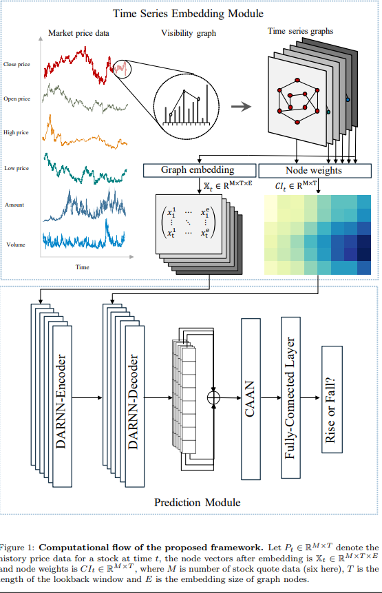
- **experiment**: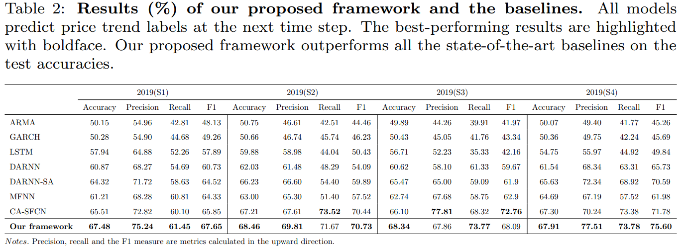

**remark**: 
    
    github里的组成看起来很规范，想法也很不错，accuracy很好，其中对照组的LSTM的accucary可以到57%，这让他的数据看起来很可信
    其中timeseries graph的建立和graph embedding很值得借鉴
    方法：VG(Visible graph)论文里这段全是废话不用看。
    我问了gpt,他的回答如下:

https://chat.openai.com/share/d661a86a-c8ef-481c-ae98-9531a5cacc4d

    简单来说就是如果两个向量满足了某种相关性就建立连个股票之间的边
    文中只用了VG建立图，但事实上，也可以用神经网络建立图，这个很值得我思考和学习
**link**:
- **GitHub code**:https://github.com/BUAA-WJR/PriceGraph
- **Paper with Code**:https://paperswithcode.com/paper/price-graphs-utilizing-the-structural

### Transfomer&pytorch（还行）:

    Trade the Event: Corporate Events Detection for News-Based Event-Driven Trading
- **author&date:**:2021 & 被ACL接收 
- **model**:transformer & 似乎有domain adaptation我没仔细看
- **data**:EDT dataset, 数据有点大，目前还没下载下来，别忘了看看！！！！！！！！
- **estimation**:

      虽然没给出accuracy,但好像我一开始很看重这篇文章，但至于为什么有点忘了，可能好不容易看到一个transformer+nlp且比较靠谱的吧？
- **framework**:pytorch
- **news relevant**:相关
- **insight**: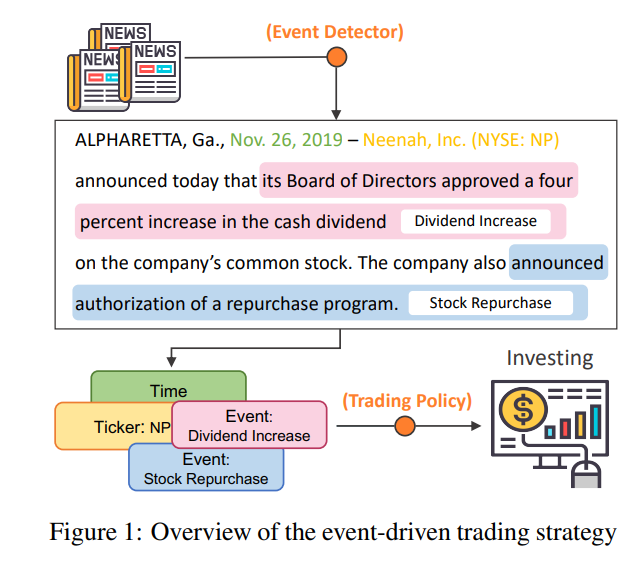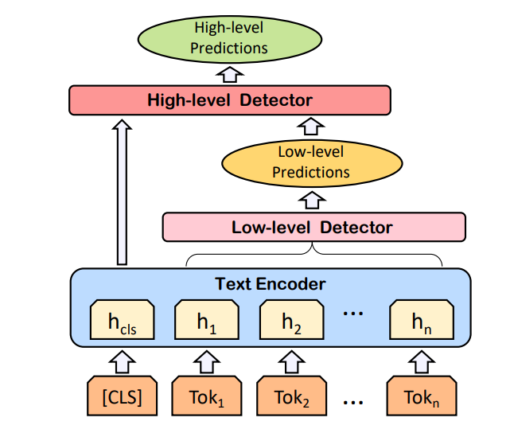
- **experiment**: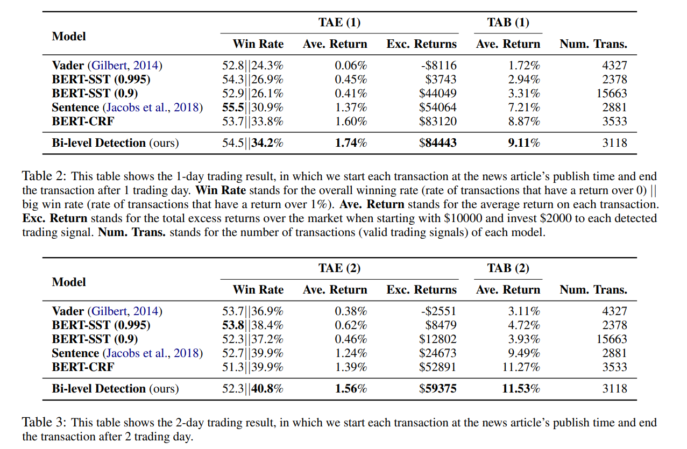

**remark**: 
    
    文章看起来还可以，但他的数据集太大了，压缩包都1.5GB，感觉可能会对我的复现和训练带来麻烦

**link**:
- **GitHub code**:https://paperswithcode.com/paper/trade-the-event-corporate-events-detection
- **Paper with Code**:https://paperswithcode.com/paper/trade-the-event-corporate-events-detection

### GAN(GRU+CNN)&pytorch（一般）:

    Stock price prediction using Generative Adversarial Networks
- **author&date:**:journal of computer science 2021 & 哥大
- **model**:GAN GRU CNN
- **data**:

      AAPL_daily_stock_data,with features such as S&P 500 index, NASDAQ Composite index, U.S. Dollar index, etc
- **estimation**:思路似乎可以，但是实验结果很不喜欢，看起来就很奇怪
- **framework**:pytorch
- **news relevant**:不相关
- **insight**:
- **experiment**: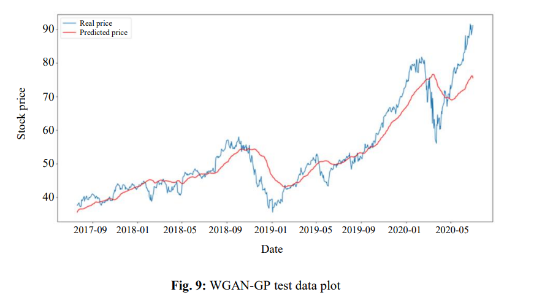

**remark**: 
    
    abstract中提到：用GRU GAN作为generator，为什么用CNN作为判别器来，我其实没太懂
    不过后来我问GPT它告诉我这个从理论上是可行的，
    这个文章是对抗网络的思路可以借鉴
    同时他对数据加入的一些人工特征也给我了一些启发，
    加入大盘的指数或许可以反应一些总体涨跌的信息，理论上可以帮助训练
**link**:
- **GitHub code**:https://github.com/ChickenBenny/Stock-prediction-with-GAN-and-WGAN
- **Paper with Code**:https://paperswithcode.com/paper/stock-price-prediction-using-generative

### GRU+GCN&tf（还行）:

    Multi-Graph Convolutional Network for Relationship-Driven Stock Movement Prediction
- **author&date:**:2020.5 & 中科院大学
- **model**:GCN+GRU
- **data**:daily_stock_data+price/volume_moving avg5 10+(p)return
- **estimation**:GCN+时序模型的思路确实很不错哦
- **framework**:tensorflow
- **news relevant**:不相关
- **insight**: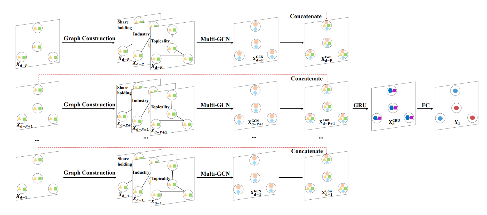
- 建立图的方法：首先根据金融领域知识将股票之间的多个关系编码为图，并利用GCN基于这些预定义图提取交叉效应
- **experiment**: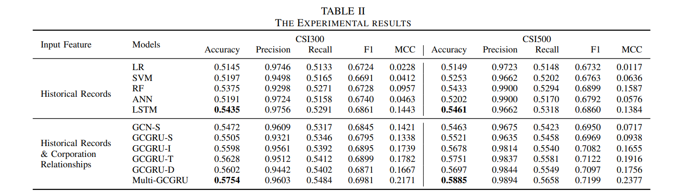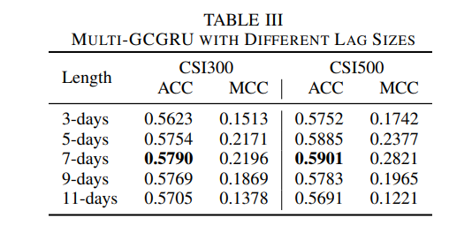

**remark**: 

    GCN+GRU的想法是很不错，并且这篇文章讨论的是accuracy
    但是实验数据里面RNN的accuracy为什么这么低
    另外，这篇文章用的是tensorflow，
    btw,这篇文章建立图的方式可以借鉴，我记得之前也看过GCN+RNN的模式
    这篇文章的feature启发：price/volume_moving avg5 10
**link**:
- **GitHub code**:https://github.com/start2020/Multi-GCGRU
- **Paper with Code**:https://paperswithcode.com/paper/multi-view-graph-convolutional-networks-for

### Adversarial A-LSTM&tf（不错）:

    Enhancing Stock Movement Prediction with Adversarial Training
- **author&date:**:2018.10 & USTC的老师
- **model**:Adversarial Attention Lstm
- **data**:

      ACL18 dataset
      ACL18 contains historical data from Jan-01-2014 to Jan01-2016 of 88 high-trade-volume-stocks in NASDAQ and NYSE markets
      KDD17 dataset
      KDD17 contains a longer history ranging from Jan-01-2007 to Jan-01-2016 of 50 stocks in U.S. markets
-**estimation**:效果看起来一般但是这毕竟是18年的，这个文章的思路很值得学习，效果一般的原因在remark里
- **framework**:tf
- **news relevant**:不相关
- **insight**: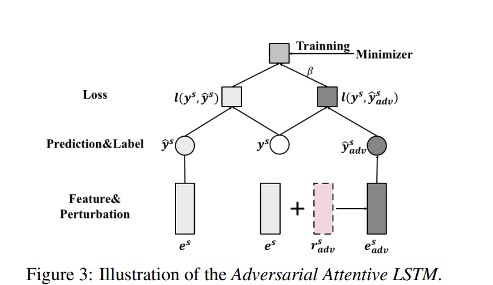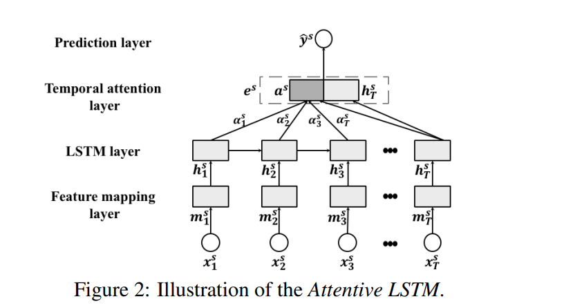
- **experiment**: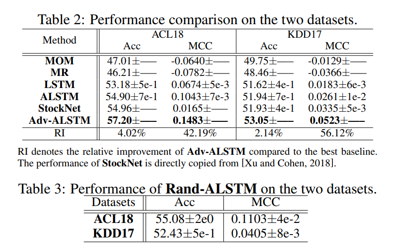

**remark**: 

    思路很好，值得借鉴阅读论文。毕竟是这个领域比较老的文章
    为什么效果一般？可能是因为数据集的问题，
    一般而言我们对某一只股票数据训练一个用于预测他自己的首收益率的模型
    如果把很多只股票放在一起，其之间的相互作用关系没有被考虑进来，简单地训练时序模型估计不太行
    可行需要GCN等来辅助提取信息
**link**:
- **GitHub code**:https://github.com/yuxiangalvin/Stock-Move-Prediction-with-Adversarial-Training-Replicate
- **Paper with Code**:https://paperswithcode.com/paper/enhancing-stock-movement-prediction-with

### GCN+LSTM&tf&pytorch（给出股票之间的关系度量）:

    Temporal Relational Ranking for Stock Prediction
- **author&date:**:2018.9 USTC老师
- **model**:重点是股票之间的关系和排名的度量等：GCN+LSTM
- **data**:NYSE
- **estimation**:思路非常值得借鉴
- **framework**:pytorch & tf
- **news relevant**:不相关，但是和行业相关
- **insight**: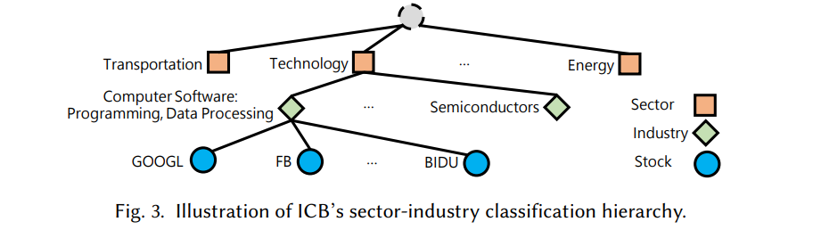

**remark**: 
    
    1）为股票定制深度学习模型排名
    2）以时间敏感的方式捕获股票关系
    这两点很重要，给以进行推广

**link**:
- **GitHub code**:https://paperswithcode.com/paper/temporal-relational-ranking-for-stock
- **Paper with Code**:https://paperswithcode.com/paper/temporal-relational-ranking-for-stock

### LSTM+VADER+DP&tf（结果很离谱，但思想不错）:

    DP-LSTM: Differential Privacy-inspired LSTM for Stock Prediction Using Financial News
- **author&date:**:2019.12 哥大 & 北理工
- **model**:ARMA+LSTM+VADER+'Differential Privacy'
- **data**:daily_stock_data+news(数据压缩包太大了，还没下下来看)
- **estimation**:思路不错，论文结果离谱或者我没看懂
- **framework**:tf
- **news relevant**:相关
- **insight**:ARIMA+LSTM+VADER+DP
- **experiment**: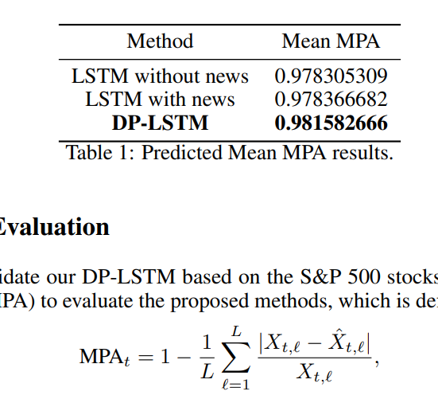

**remark**: 
    
    文章的结果是accuracy可以到0.9几，很离谱，
    感觉他是不是混淆了mean prediction accuracy和accuracy
    虽然我也不知道MPA为什么这么定义，但我感觉这个加入新闻的思路很值得借鉴
    不过感觉和news沾边的数据量真的好大
**link**:
- **GitHub code**:https://github.com/Xinyi6/DP-LSTM-Differential-Privacy-inspired-LSTM-for-Stock-Prediction-Using-Financial-News
- **Paper with Code**:https://paperswithcode.com/paper/dp-lstm-differential-privacy-inspired-lstm

### LSTM+RF&tf（还行）:

    S&P 500 Stock Price Prediction Using Technical, Fundamental and Text Data
- **author&date:**:2021.8 & 南卡
- **model**:LSTM+Random Forest
- **data**:

      weekly historical prices, finance reports, and text information from news items
- **estimation**:

      accuracy非常好，思路清晰，但是你用的是weekly的数据....
- **framework**:tf
- **news relevant**:相关
- **experiment**: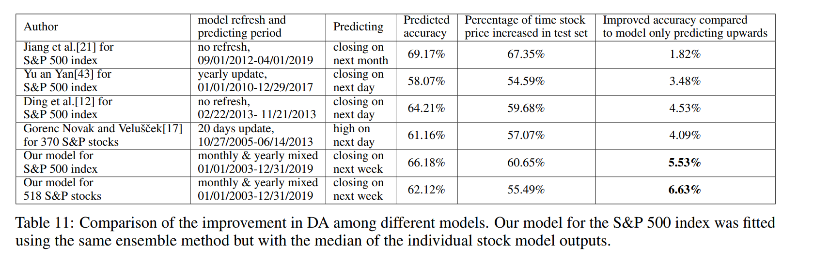

**remark**: 
    
    结果很好，可惜是weekly的数据，
    news+fundamental+technical的数据准备很值得借鉴
    只是用的是tf，要是用pytorch就好了
**link**:
- **GitHub code**:https://github.com/Shanlearning/SP-500-Stock-Prediction
- **Paper with Code**:https://paperswithcode.com/paper/s-p-500-stock-price-prediction-using

### VAETransfomer&pytorch（不错）:

    FactorVAE: A Probabilistic Dynamic Factor Model Based on Variational Autoencoder for Predicting Cross-Sectional Stock Returns
- **author&date:**:2022 & 清华
- **model**:DFM + VAE + Transfomer
- **data**:daily_stock_data+rank选股任务
- **estimation**:

      看起来不错，思想可以学习学习，可以试试在个股上的正确率怎么样
- **framework**:pytorch
- **news relevant**:不相关
- **insight**: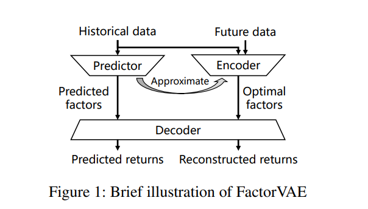
- **experiment**: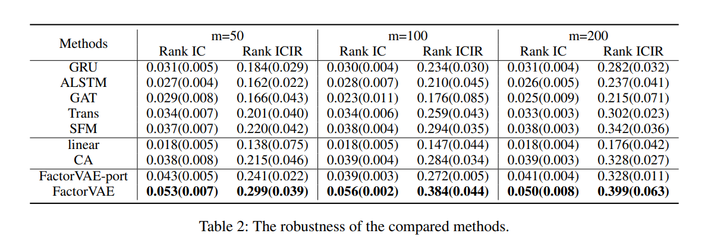

**remark**: 
    
    其实我没看明白这个future_data是怎么放进去的
    这个文章改进Transformer的思路很值得学习
**link**:
- **Paper with Code**:https://paperswithcode.com/paper/factorvae-a-probabilistic-dynamic-factor


######################################################################################################################


# 下面都是不被看好的文章，但还是记录一下为什么不行或者他的优点

### Title（很久远的文章，看看理论吧）:
    Automatic Relevance Determination in Nonnegative Matrix Factorization with the β-Divergence
- **data**:'the swimmer dataset'
- **framework**:pytorch但是2011年

**remark**: 

    一种具有beta散度的半正定矩阵分解，
    或许在我日后需要给文章加点数学的时候用到
**link**:
- **Paper with Code**:https://paperswithcode.com/paper/automatic-relevance-determination-in

### Title（不好，但论文的结构很可取）:
    Stock Price Prediction Based on Natural Language Processing
- **author**:2022 & 贸大、西财
- **experiment**: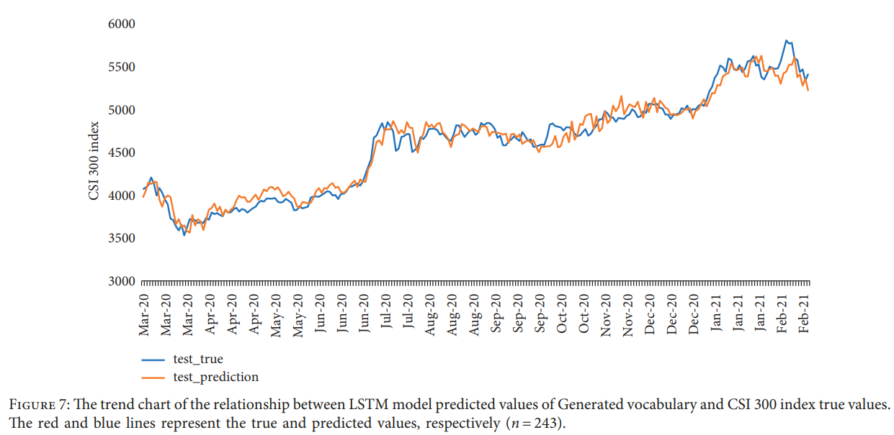
- **framework**:Mindspore5

**remark**: 
    
    用RMSE作为指标是反面教材，但文章的结构和写作很清晰，很值得借鉴
    另外，文章的框架是华为的MindSpore，我也是第一次见，有时间可以学习一下
**link**:
- **Paper with Code**:https://paperswithcode.com/paper/stock-price-prediction-based-on-natural


### Title（不看好，但网络设计思路可取）:
    Particle Filter Recurrent Neural Networks
- **author**:2019.3 & 新国立
- **framework**:pytorch
- **data**:原问题是机器人相关的，对也股票涨跌进行了预测，就是结果离谱
- **insight**: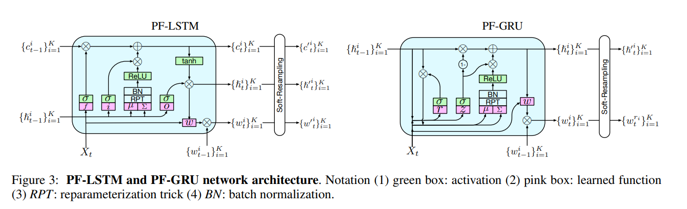
- **experiment**: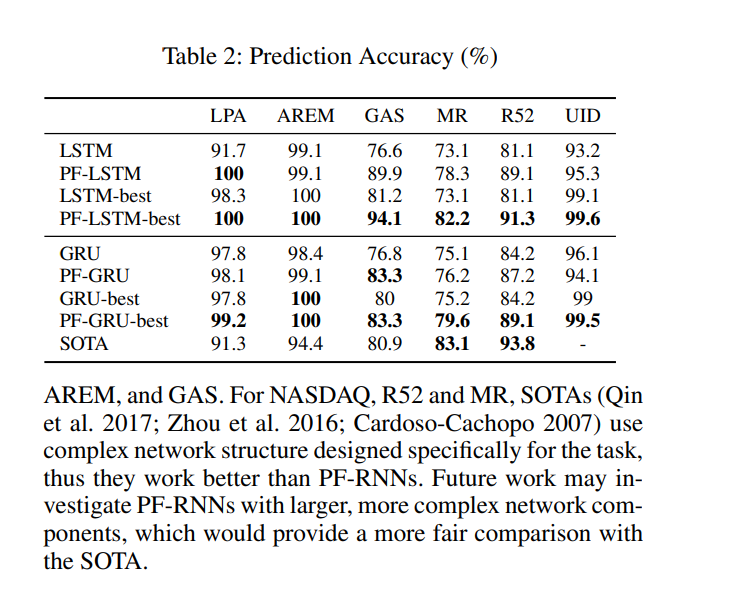

**remark**: 
    
    文章构建模型的思路可取，大体是在RNN里加入了一些权重的东西
    但是结果离谱，accuracy可以到0.9几，我觉得可能是他的分类标准和一般的不同
**link**:
- **Paper with Code**:https://paperswithcode.com/paper/particle-filter-recurrent-neural-networks


### Title（和ai关系不大，传统alpha因子相关）:
    Trader Company Method: A Metaheuristic for Stock Selection
**remark**: 
    
    日本人搞的传统交易算法的开发，对毕设没什么帮助有兴趣可以开阔开阔眼界
**link**:
- **Paper with Code**:https://paperswithcode.com/paper/trader-company-method-a-metaheuristic-for

### Title（不看好，想水论文要跟这个学）:
    Multi-step-ahead Stock Price Prediction Using Recurrent Fuzzy Neural Network and Variational Mode Decomposition
**remark**:用了离散余弦变换处理数据
**link**:
- **Paper with Code**:https://paperswithcode.com/paper/multi-step-ahead-stock-price-prediction-using

### Title（不看好，大模型相关）:

- **data**:eg:有ACL18 dataset等
- **remark**: 
  
    基于LLM的微调的大模型，有点意思，先记录一下，图一个乐
  **link**:
- **GitHub code**:https://github.com/chancefocus/pixiu
- **Paper with Code**:https://paperswithcode.com/paper/pixiu-a-large-language-model-instruction-data

### Title（拿不准）:
    Detach-ROCKET: Sequential feature selection for time series classification with random convolutional kernels
- **author**:2023.9 瑞典皇家理工学院
- **data**:他没有给出dataset,只给了一个py文件，加载data
- **model**:ROCKET+特征选择' Detach-ROCKET'
- **experiment**: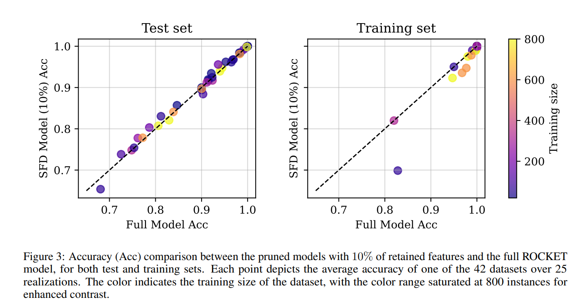

**remark**: 

    论文提出改进的ROCKET(RadOm Convolutional KErnel Transform)方法，用于时间序列分类
    说他是RNN更好的模型，这个思路不错，我可以借鉴一下
**link**:
- **GitHub code**:https://github.com/gon-uri/detach_rocket
- **Paper with Code**:https://paperswithcode.com/paper/detach-rocket-sequential-feature-selection

### Title（不看好）:
    Learning Multiple Stock Trading Patterns with Temporal Routing Adaptor and Optimal Transport
- **data**:他是写了两个py文件，我也没看懂他的data从哪来的
- **insight**: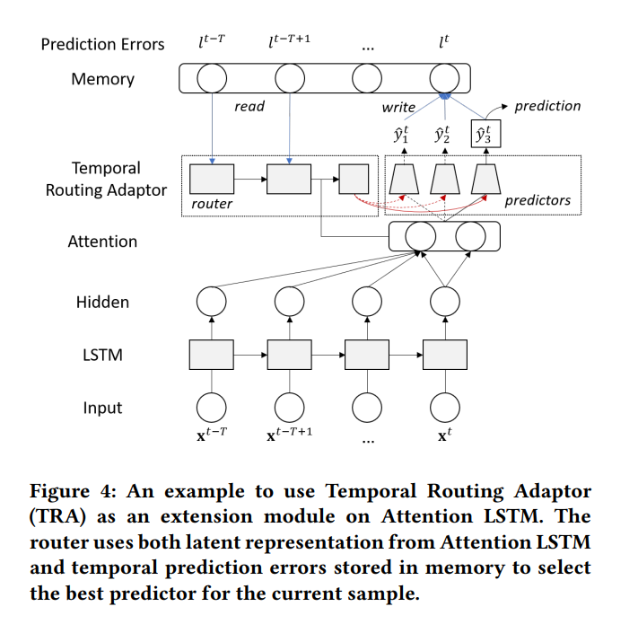
- **experiment**: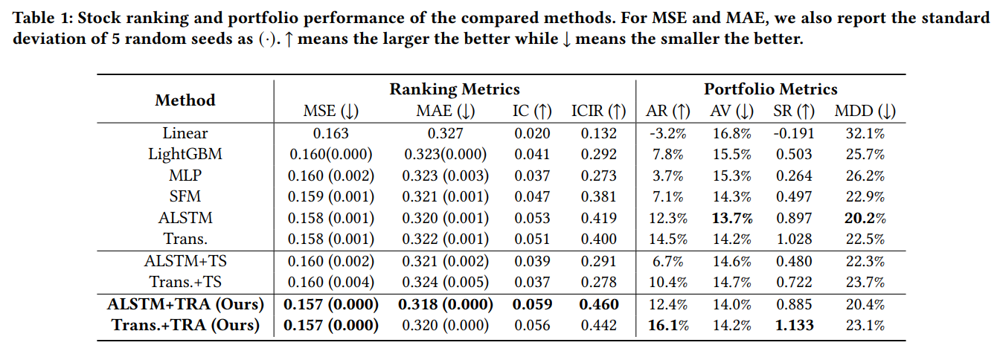

**remark**: 
    
    时间序列模型加了一个；类似attention的东西，我要是想水论文就跟着这个的思路走
    这个的代码是基于微软的qlib平台
    此外，作者挺实诚，把自己的困惑写在github上了
    对于这些困惑：我或许也会遇到，或者这些也是很好的点子
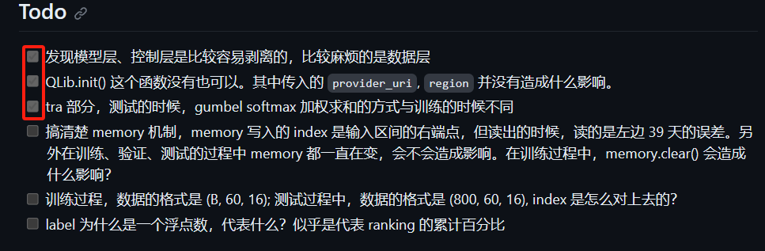
**link**:
- **GitHub code**:
- **Paper with Code**:


### Title（不看好吗，你没代码，效果固然好）:
    （你accuracy非常好，但是你github上没有code只有data，你的构建model的思路值得我好好学习借鉴）
    Multi-modal Attention Network for Stock Movements Prediction
- **data**news+很奇怪的stock_data
- **experiment**:

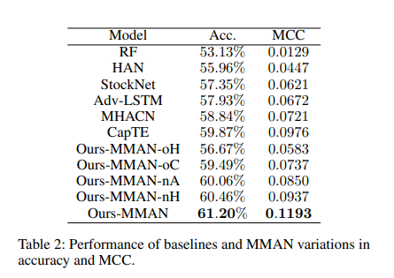

**insight**: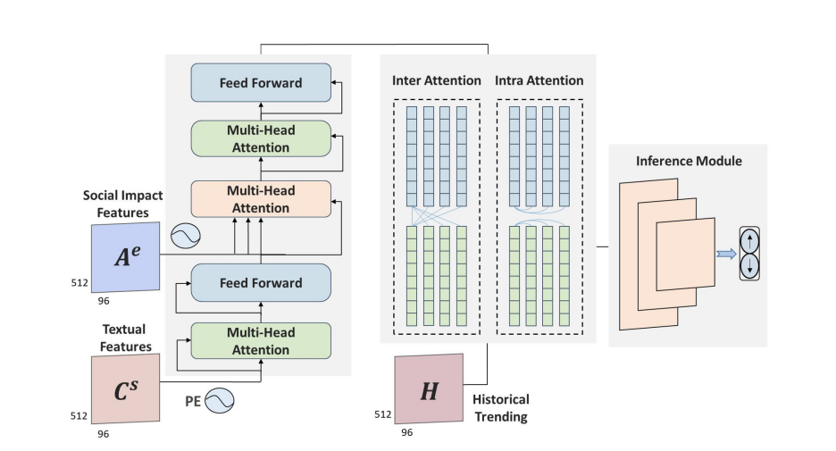

**remark**: 
    
    没代码，model是Transformer的改版，数据集很奇怪，但是效果很好，accuracy可以到61%
**link**:
- **GitHub code**:https://github.com/HeathCiff/Multi-modal-Attention-Network-for-Stock-Movements-Prediction
- **Paper with Code**:https://paperswithcode.com/paper/multi-modal-attention-network-for-stock


### Title（不看好）:
    Attention-based CNN-LSTM and XGBoost hybrid model for stock prediction
- **data**:形如

    ts_code,trade_date,open,high,low,close,pre_close,change,pct_chg,vol,amount,turnover_rate,volume_ratio,pe,pb,ps,total_share,float_share,free_share,total_mv,circ_mv
- **abstract**:

    ARIMA处理数据，cnn-lstm是总体，xgboost微调，预测股票价格，框架tensorflow
- **experiment**:这个预测股价基本就是胡闹了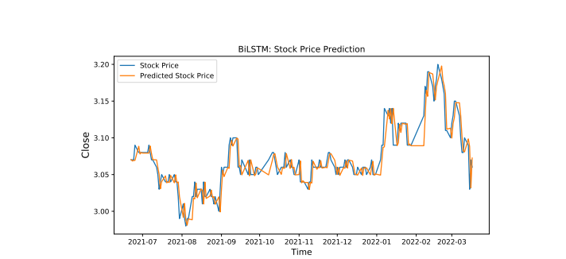

**remark**: 
    
    预测股价看起来就很不靠谱，但看在你github上star比较多我还是记录一下，要是不选这个也记录个理由
    CNN-LSTM+XGBoost的结构我还是第一次见，有水文章嫌疑
    CNN-LSTM是胡闹吗？gpt答：不是，CNN-LSTM是CNN和LSTM的结合，CNN用于提取局部特征，LSTM用于提取序列特征
    另外我从直观上来讲，你这个cnn作用于feature是高开低收的股票数据没有任何理由
**link**:
- **GitHub code**:https://github.com/zshicode/attention-clx-stock-prediction
- **Paper with Code**:https://paperswithcode.com/paper/attention-based-cnn-lstm-and-xgboost-hybrid
- **同一个作者的文章（关于GCN和股票预测）**：https://paperswithcode.com/paper/differential-equation-and-probability


########################################################################################
# 下面是Summary的模板：

## Title:

- **author&date:**:
- **model**:
- **data**:
- **estimation**:
- **framework**:
- **news relevant**:
- **insight**:
- **experiment**:

**remark**: 
    
    
    
**link**:
- **Paper with Code**:

### Title（不看好）:

- **data**:形如
- **experiment**:

**remark**: 
    
    
**link**:
- **Paper with Code**: