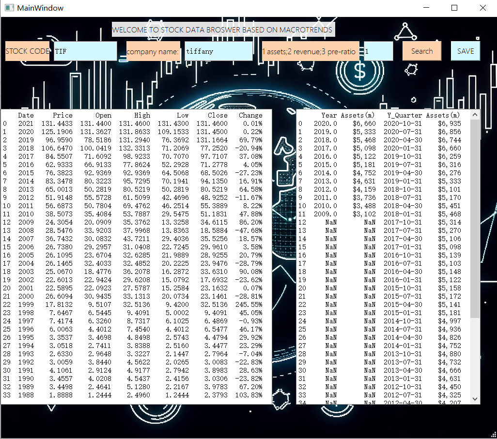

# 这是关于获取股票数据的应用程序
### TEST2-4均是可执行文件，是不同进度时的备份；其中TEST2是最初的版本，TEST3是第二次修改，TEST4是最终版本
### TEST5是实验说明和总结

### 1.实现的功能：

    1. 用户输入股票代码CODE和对应公司name的名称，我们去爬取对应股票的数据
    2. 用户需要输入mission的编号：1_total assets 2_revenue 3_pe-ratio
    3. 用户点击search按钮进行搜索，点击save按钮会自动在用户桌面上生成一个csv文件，文件名为CODE_name.csv
    4. 提示：可以输入('TIF', 'tiffany','1') ('LFCHY','china-life-insurance','3')

### 2.效果展示：

1. 搜索成功！

2. 在桌面上生成的csv文件

### 3.一些遗憾：

    1.本来想做一个直接可以模拟点击网页中'download'按钮的应用程序，但是发现这个按钮是用js写的，所以没办法直接模拟点击，只能爬取数据后自己生成csv文件
    2.在爬取数据中我发现，一些数据格内会有链接，但是我不知道怎么爬取这个链接，所以只能爬不带有链接的文本
    3.我在第一个应用程序中写了显示实时时间的程序，后来发现没啥实际用处，不如save按钮实用，所以在这个应用程序中就没有写显示实时时间的程序了